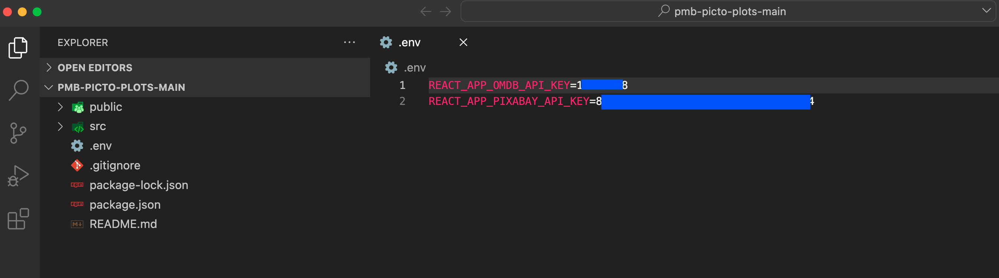
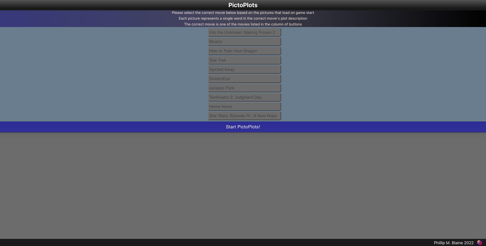
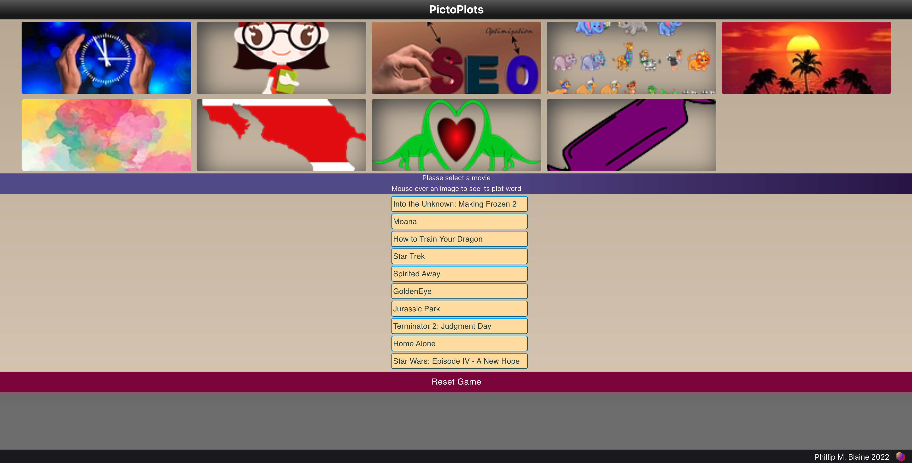
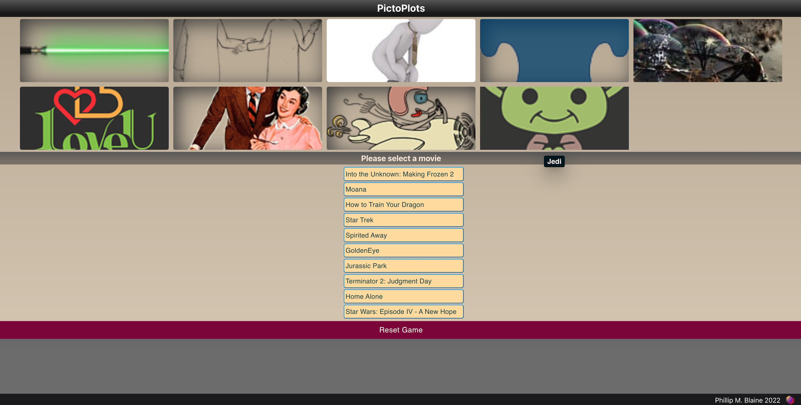
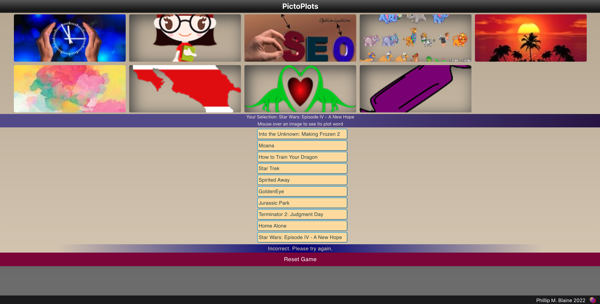
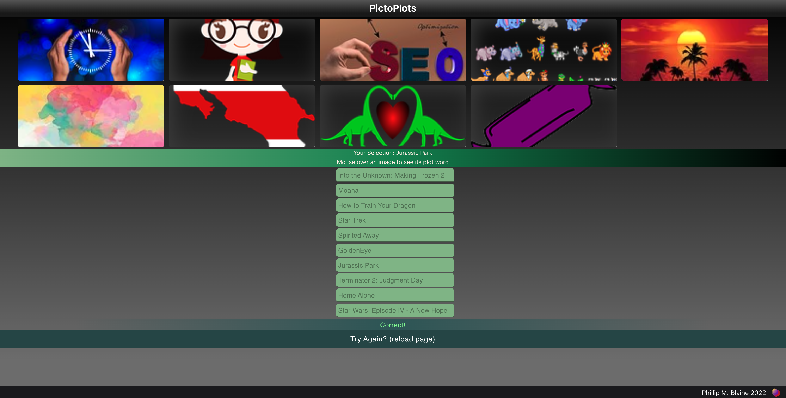

# PictoPlots: pmb-picto-plots README Notes

## Features

#### Version 1.0, 2022-10-09
- Single Page Application (SPA)
- Built with React/JavaScript (ReactJS), Material UI, styled components, SCSS
- Repository: GitHub
- Deployment and Domains: Vercel

## GitHub
- Repository: https://github.com/phillipmblaine/pmb-picto-plots

## Vercel
### Deployment: https://vercel.com/phillipmblaine/pmb-picto-plots/39EQCCuBNFvoEWgk3KispZdFcBMq
### Domains:
- https://pmb-picto-plots.vercel.app/
- https://pmb-picto-plots-phillipmblaine.vercel.app/
- https://pmb-picto-plots-git-main-phillipmblaine.vercel.app/
 

# About PictoPlots
### PictPlots is a game where the objective is to correctly guess which title out of a list of ten (10) predetermined movie titles is represented by a collection of pictures
* The movie title that is the correct solution is randomly selected from the list of ten (10) predetermined movie titles
  

### The pictures loaded into the game are based on image search results from the words in the plot of the movie selected to be the correct answer
* Each loaded picture is matched to a single word in the plot of the movie that is the correct answer
  
  
### On game start, required game data is fetched:
* Movie plot data: from OMDb API: -> https://www.omdbapi.com/
* Plot picture search results: from Pixabay API -> https://pixabay.com/api/docs/
* How data is fetched, order of data fetching:
  * 1) Movie plot data of the movie that is the correct answer is fetched from the OMDb API
  * 2) The plot data is iterated over and search results are fetched from the Pixabay API for each plot data word (up to 10 words) used in the game
  * 3) Pictures are displayed on front end UI once data is received

# Getting Started: PictoPlots Setup
## If running by following one of the Vercel online domain links listed above in the 'Features' section:
* Follow one of the domain links by clicking on one of the links to open it in a web browser, or copy/paste one of the domain links into the address bar of a web browser of your choice (Google Chrome, Mozilla Firefox, Safari, Microsoft Edge, etc.)
* No additional setup is required: PictoPlots should be ready to play in your web browser upon loading the followed domain link's page
  

## If running locally:
* <strong>API Keys are required for:</strong>
  * <strong>OMDb API</strong>
  * <strong>Pixabay API</strong>
## <strong>How to acquire OMDb and Pixabay API Keys:</strong>
  * (If you already have OMDb and Pixabay API keys, you may skip the API key acquisition processes)
  * <strong>For the OMDb API Key:</strong>
    * 1) On the home page of the OMDb API site (http://www.omdbapi.com/), click on the 'API Key' tab
          * (also accessible here: http://www.omdbapi.com/apikey.aspx)
    * 2) In the 'Generate API Key' form, select the free option ('FREE! (1,000 daily limit)'), input your email, and follow instructions to acquire your OMDb API Key
  * <strong>For the Pixabay API Key:</strong>
    * 1) Register for a Pixabay user account: on the home page of the Pixabay site (https://pixabay.com/), click 'Join' on the main navbar in the upper right corner to the left of the 'Upload' button. Follow the steps to create a Pixabay user account.
    * 2) Once your user account registration is complete, login to your account
    * 3) While logged in: on the home page of the Pixabay site (https://pixabay.com/), select 'Explore' on the main navbar in the upper right corner next to the left of the user account icon and 'Upload' button. A dropdown menu will open. Select 'API' in the dropdown menu.
    * 4) Follow the newly loaded page to the API documentation
          * (also accessible here: https://pixabay.com/api/docs/)
    * 5) On the API documentation page, scroll down to Search Images->parameters->key. Your API key is listed here
          * (also accessible here: https://pixabay.com/api/docs/#api_key)
## How to Download PictoPlots, use your API Keys, and run PictoPlots locally:
  * 1) Download the pmb-picto-plots repository (https://github.com/phillipmblaine/pmb-picto-plots) by cloning or ZIP
  * 2) Open the project in Visual Studio Code from the root of the project folder, pmb-picto-plots-main
        * If downloaded by ZIP, extract the contents first, then open the project from the root of the project folder, pmb-picto-plots-main
  * 3) In the root of the pmb-picto-plots-main folder, create a new file, .env
  * 4) In the .env file, create two new variables:
        * REACT_APP_OMDB_API_KEY
        * REACT_APP_PIXABAY_API_KEY
  * 5) Set your API keys as values to your variables (make sure to save the .env file after adding your API keys as values):
        * REACT_APP_OMDB_API_KEY=yourOmdbApiKey
        * REACT_APP_PIXABAY_API_KEY=youryourPixabayApiKey
        * Your project root structure and .env file should look similar to the image below:  
      
  * 6) With your api keys in place, it will be possible to run PictoPlots locally: in the root of the project folder pmb-picto-plots-main, open the console (can be done by opening your console: PowerShell, terminal, etc. and navigating to the root of the project folder, or also by: while the project is open in Visual Studio Code, open the console in VSC, often keyboard shortcut bound to Ctrl + `):
    * a) run in console:
      * npm install
        * (wait for install to finish, a nodule_modules with package install contents inside will generate in the root of the project folder)
    * b) run in console:
      * npm start
        * (development mode/build)
  * 7) A window may automatically open in your default web browser navigated to http://localhost:3000/ where you can finally try out PictoPlots!
        * (also possible to manually navigate to http://localhost:3000/ in a web browser of your choice as long as npm start was ran in console, and is still running)
        * Running PictoPlots locally can be stopped by terminating npm start: in the console it is running from, press Ctrl+C to stop execution, and/or close out the terminal completely)
 

# How to Play PictoPlots
## 1) On initial page load, please start the PictoPlots game by clicking on the blue 'Start PictoPlots!' button
* A list of ten (10) predetermined movie titles is on display in a column of buttons
* Of the ten (10) movie titles, one (1) movie title will be randomly selected to be the correct answer for PictoPlots once the game begins
* The movie title buttons are disabled until the game starts

  

 

## 2) Once the pictures are loaded and the buttons are enabled, select the movie you believe is represented by the pictures by clicking on the button with your guess's movie title in the list of ten (10) predetermined movie titles
* The movie that is the correct answer is randomly selected from the list of ten predetermined (10) movie titles 

  

 

## 3) If you would like any hints, hover on/mouseover any of the pictures to reveal the specific plot word each picture represents

  

 

## 4) If your guess is incorrect, do not worry! you are welcome to guess as many times as you like
* The 'Reset PictoPlots' button below the predetermined movie title list may also be used to reload the page and start PictoPlots over
* The 'Reset PictoPlots' button may be used at any time after the 'PictoPlots' game begins to start over
 

  

 

## 5) If your guess is correct, you win!
  * The game ends if your answer is correct (predetermined movie title buttons become disabled, color scheme changes). You may reset the game by clicking the 'Reset PictoPlots' button to reload the page and start over
  * The 'Reset PictoPlots' button below the predetermined movie title list may also be used to reload the page and start PictoPlots over
 

  

 

# Features/Ideas/Improvements for Future Versions
* Game Play, User Experience
* Difficulty modes: easy, normal/medium, hard, super hard
* More game modes
  * Possible examples:
    * Mix and match: call plot words for two (or more) movie titles, have a guessing game for which title belongs to which image/plot word
    * Preview/explore mode: allow the player to manually select a movie in the predetermined list to check and see what the image results would be without necessarily playing the game
    * Trivia: implement trivia along with, or separately from, the plot pictures game mode as a hint system or, if separate from that mode, a guessing game for selecting the correct movie title
* Player option to control how many pictures to have a available on load
* Player option to reload a set of new pictures for the movie title that is the correct answer (perhaps pictures could be from a fresh call, could be from results stored locally, in back end database/server)
* Possibility to filter searched pictures for mature content in case something questionable might be fetched?
* Score tracker of correct and incorrect guess over time (stored locally, stored in back end database/server)
  

* Front End, User Interface
  * Improved styling:
    * Improve appearance/styling of images: experiment with shadows, transformation/scaling without disrupting/moving other elements, etc.
    * Enriched, expanded, optimized, refined use of existing styling: Material UI and its styling options: emotion, makeStyles, sx, useStyles, themes, etc., styled components, SCSS
    * Explore new styling options
  * Improve UI in any way possible, new ideas for UI to make it more attractive and user friendly, perhaps more lively, sound effects, animations, etc.
  * Light/Dark mode toggle
  * Loading overlays while component is resetting, updating, initializing, data fetching
  * React npm install, node_modules: optimize build and efficiency, remove unnecessary installs/packages, address any outdated packages, warnings, etc. that may be present
  * Responsive interface: test support for different resolutions, mobile devices, adjustments to make the project user friendly on all devices
  * TypeScript implementation
  * User Themes
  * Web browser compatibility: test PictoPlots across multiple browsers to ensure functionality, compatibility (Google Chrome, Mozilla Firefox, Safari, Microsoft Edge, Opera, etc.)
  
* Back End
  * Back end implementation: node, server, PostgreSQL, ORM (Sequelize, Prisma), etc.
  * With back end implementation, API data, user data, scores, etc. could be stored locally, on hosted database/server, user login system, etc.
    * Storing data locally/on database/server could help improve efficiency, cut down on frequency of api calls 
 

# Resources
* GitHub:
  * https://github.com/
  

* Material UI:
  * https://mui.com/material-ui/
  * https://smartdevpreneur.com/
  * https://smartdevpreneur.com/material-ui-makestyles-usestyles-createstyles-and-withstyles-explained/
  

* OMDb API:
  * http://www.omdbapi.com/
  

* Pixabay API:
  * https://pixabay.com/api/docs/
  

* React:
  * https://reactjs.org/
  

* Stack Overflow:
  * https://stackoverflow.com/
  * https://stackoverflow.com/questions/57918784/javascript-react-push-to-an-array-in-usestate
  * https://stackoverflow.com/questions/71155410/pass-setstate-from-parent-to-its-child-component-using-react-hook
  * https://stackoverflow.com/questions/52206812/pushing-to-react-state-array
  * https://stackoverflow.com/questions/67073085/react-hook-usestate-cannot-be-called-at-the-top-level-react-hooks-must-be-cal
  * https://stackoverflow.com/questions/67135534/react-setstate-with-usestate
  

* Styled Components and Emotion:
  * https://styled-components.com/
  * https://emotion.sh/docs/styled
  

* Vercel:
  * https://vercel.com/